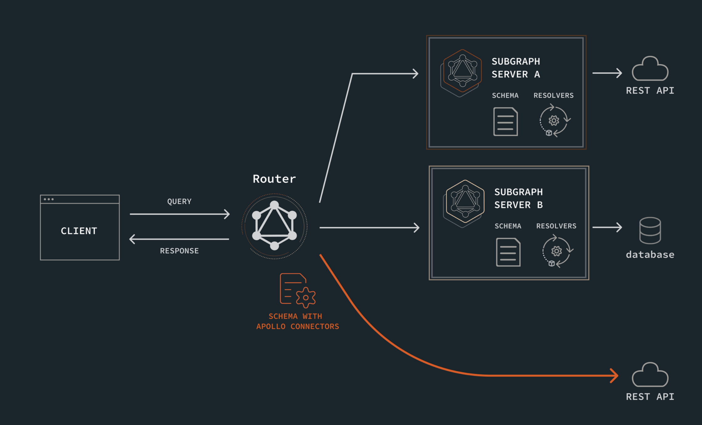
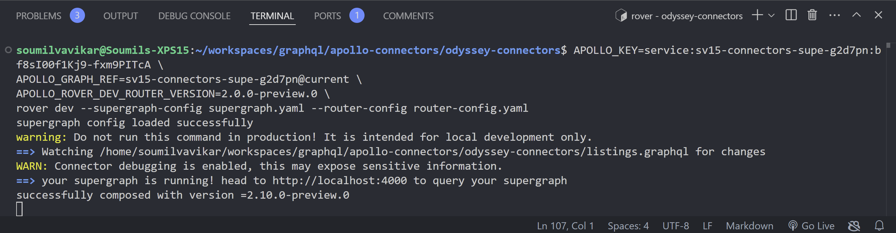
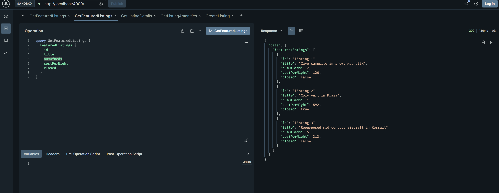
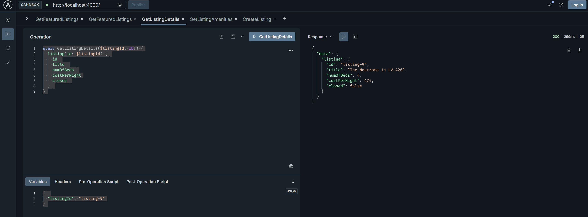
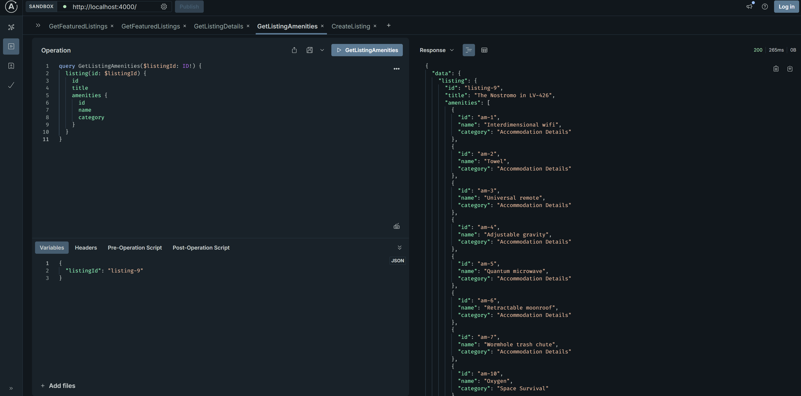
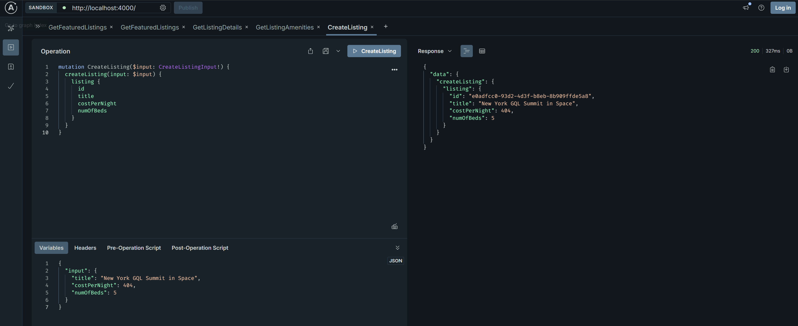

# Sample Repository for Apollo Connectors

## About Connectors

**Apollo Connectors** enable us to easily integrate REST APIs into the supergraph, without leaving the comfort of the schema!

When implementing a subgraph server, the process typically begins with the schema: we define our types and fields. Then, we need to select a language and GraphQL server framework to develop in. Each of our schema's types and fields needs resolver functions, which contain the logic to populate the data for that particular type or field by connecting to the necessary data sources. These data sources are, more often than not, existing REST APIs. To complicate matters further, the REST API responses will often differ greatly from the shape of our schema; this leaves us writing even more code just to map data into the types and fields the GraphQL server expects.

With Apollo Connectors, we can skip the time-intensive steps of spinning up a subgraph server and writing resolver code. Instead, we can work directly in the schema to map our REST API data to our schema's types and fields. With this connectors-enabled schema, the router creates a query plan that will directly call our REST API endpoints, plucking out the properties we've defined. That's right, all we need is the schema!



## Prerequisites

### Rover CLI

As of October 22, 2024, this is a preview capability and we would need `v0.27.0-preview.0` version of rover cli.

```shell
# Linux
curl -sSL https://rover.apollo.dev/nix/v0.27.0-preview.0 | sh

# Powershell
iwr 'https://rover.apollo.dev/win/v0.27.0-preview.0' | iex

# If you've already installed Rover before, you'll get a message asking if you'd like to overwrite the existing installation. Type y and hit enter to continue.

# Check rover version 
rover --version
```

## Running the Supergraph

```shell
# Use the Apollo Key and Apollo Graph Ref for the supergraph and organization we want to refer to.
# Sample mentioned in the rover-dev.md
APOLLO_KEY="..." \
APOLLO_GRAPH_REF="..." \
APOLLO_ROVER_DEV_ROUTER_VERSION=2.0.0-preview.0 \
rover dev --supergraph-config supergraph.yaml --router-config router-config.yaml
```



## Understanding Connector Implementation

Check the `listings.graphql` schema file.

### Step 1: Add imports for @source and @connect Annotations

```graphql
@link(
     url: "https://specs.apollo.dev/connect/v0.1"
     import: ["@source", "@connect"]
   )
```

### Step 2: Add the RESTful API to be Connected

```graphql
  @source(name: "v1"
  http: { baseURL: "https://rt-airlock-services-listing.herokuapp.com/" })
```

This sets up the base for using connectors to map the RESTful API to the GraphQL Queries and Mutations.

### Step 3: Update the Queries and Mutations using @connect Annotation

Take a look at the `listings.graphql` file and look for `@connect` annotation and how its implemented.

Example:

```graphql
@connect(
    source: "v1"
    http: { GET: "/listings/{$args.id}" }
    selection: """
    id
    title
    numOfBeds
    costPerNight
    closed: closedForBookings
    amenities {
      id
      category
      name
    }
    """
  )
```

One important thing to look here is for the `ameneties` type inside of the `listing` type and how it is connected to federated the query instead of it being sequential

```graphql
"The amenities available for this listing"
  amenities: [Amenity!]!
    @connect(
      source: "v1"
      http: { GET: "/listings/{$this.id}/amenities" }
      selection: """
      id
      name
      category
      """
    )
```

If the above `@connect` is not used, the supergraph would make sequential calls to the `listing` and then `listing/<id>/amenities` API.

### Step 4: Test the Connectors Using Queries and Mutations

Open the `Apollo Studio` for the local instance of the supergraph by going to the <http://localhost:4000/>. Then you can try the following queries and mutation.

#### Queries

##### Get Featured Listings

```graphql
query GetFeaturedListings {
  featuredListings {
    id
    title
    numOfBeds
    costPerNight
    closed
  }
}
```

**Response**:

```json
{
  "data": {
    "featuredListings": [
      {
        "id": "listing-1",
        "title": "Cave campsite in snowy MoundiiX",
        "numOfBeds": 2,
        "costPerNight": 120,
        "closed": false
      },
      {
        "id": "listing-2",
        "title": "Cozy yurt in Mraza",
        "numOfBeds": 1,
        "costPerNight": 592,
        "closed": true
      },
      {
        "id": "listing-3",
        "title": "Repurposed mid century aircraft in Kessail",
        "numOfBeds": 5,
        "costPerNight": 313,
        "closed": false
      }
    ]
  }
}
```



##### Get Listings Details

```graphql
query GetListingDetails($listingId: ID!) {
  listing(id: $listingId) {
    id
    title
    numOfBeds
    costPerNight
    closed
  }
}
```

```json
#Variables
{
  "listingId": "listing-9"
}
```

**Response**:

```json
{
  "data": {
    "listing": {
      "id": "listing-9",
      "title": "The Nostromo in LV-426",
      "numOfBeds": 4,
      "costPerNight": 474,
      "closed": false
    }
  }
}
```



##### Get Listings With Amenities

```graphql
query GetListingAmenities($listingId: ID!) {
  listing(id: $listingId) {
    id
    title
    amenities {
      id
      name
      category
    }
  }
}
```

```json
#Variables
{
  "listingId": "listing-9"
}
```

**Response**:

```json
{
  "data": {
    "listing": {
      "id": "listing-9",
      "title": "The Nostromo in LV-426",
      "amenities": [
        {
          "id": "am-1",
          "name": "Interdimensional wifi",
          "category": "Accommodation Details"
        },
        {
          "id": "am-2",
          "name": "Towel",
          "category": "Accommodation Details"
        },
        {
          "id": "am-3",
          "name": "Universal remote",
          "category": "Accommodation Details"
        },
        {
          "id": "am-4",
          "name": "Adjustable gravity",
          "category": "Accommodation Details"
        },
        {
          "id": "am-5",
          "name": "Quantum microwave",
          "category": "Accommodation Details"
        },
        {
          "id": "am-6",
          "name": "Retractable moonroof",
          "category": "Accommodation Details"
        },
        {
          "id": "am-7",
          "name": "Wormhole trash chute",
          "category": "Accommodation Details"
        },
        {
          "id": "am-10",
          "name": "Oxygen",
          "category": "Space Survival"
        },
        {
          "id": "am-22",
          "name": "Hydroponic garden",
          "category": "Outdoors"
        },
        {
          "id": "am-23",
          "name": "Space view",
          "category": "Outdoors"
        },
        {
          "id": "am-24",
          "name": "Time travel paradoxes",
          "category": "Outdoors"
        },
        {
          "id": "am-15",
          "name": "Water recycler",
          "category": "Space Survival"
        },
        {
          "id": "am-16",
          "name": "Panic button",
          "category": "Space Survival"
        },
        {
          "id": "am-17",
          "name": "Emergency life support systems",
          "category": "Space Survival"
        }
      ]
    }
  }
}
```



#### Mutation

##### Create Listings

```graphql
mutation CreateListing($input: CreateListingInput!) {
  createListing(input: $input) {
    listing {
      id
      title
      costPerNight
      numOfBeds
    }
  }
}
```

```json
# Variables
{
  "input": {
    "title": "New York GQL Summit in Space",
    "costPerNight": 404,
    "numOfBeds": 5
  }
}
```

**Response**:

```json
{
  "data": {
    "createListing": {
      "listing": {
        "id": "e0adfcc0-93d2-4d3f-b8eb-8b909ffde5a8",
        "title": "New York GQL Summit in Space",
        "costPerNight": 404,
        "numOfBeds": 5
      }
    }
  }
}
```



**NOTE**: You can find the [course lessons and instructions](https://apollographql.com/tutorials/connectors-intro-rest) on Odyssey, [Apollo](https://apollographql.com)'s learning platform.
